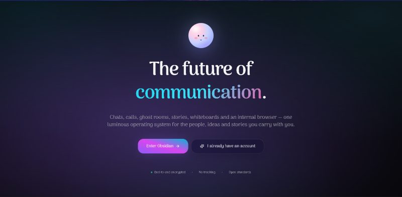

<p align="center">
  
</p>

<h1 align="center">Obsidian</h1>

<p align="center">
  <strong>The Future of Communication.</strong><br/>
  A futuristic communication OS — real-time chats, stories, voice & video calls, ghost rooms, communities, a collaborative whiteboard and an encrypted vault, all wrapped in a luminous glassmorphic interface and backed by Supabase + LiveKit.
</p>

<p align="center">
  
  
  
  
  
  
  
</p>

> Think Telegram × Discord × Instagram × WhatsApp × Linear × Arc — distilled into a single secure, animated OS for messages, calls, ghost rooms, stories, files and whiteboards. Built with a real-time Supabase backend and a LiveKit-powered call stack.

---

## Table of contents

1. [Overview](#overview)
2. [Features](#features)
3. [Architecture](#architecture)
4. [Tech stack](#tech-stack)
5. [Getting started](#getting-started)
6. [Supabase setup](#supabase-setup)
7. [LiveKit setup](#livekit-setup)
8. [Environment variables](#environment-variables)
9. [Scripts](#scripts)
10. [Project structure](#project-structure)
11. [Realtime channels](#realtime-channels)
12. [Internationalization](#internationalization)
13. [Keyboard shortcuts](#keyboard-shortcuts)
14. [Notes & caveats](#notes--caveats)

---

## Overview

Obsidian is a premium, production-grade communication platform built on **Next.js 15 (App Router)** with **React 19**. Every surface is fully wired end-to-end to a **Supabase** backend (Postgres + Auth + Realtime + Storage + pg_cron) and a **LiveKit Cloud** call stack — chats, stories, presence, typing, reactions, calls, scheduled messages, blocked users and storage all persist and sync across devices in real time.

The product ships with a theme engine (dark / light / system + accent colors + glass intensity), 9-language internationalization with RTL, a command palette, a **native AI assistant also named Obsidian**, route-level skeleton loaders, and motion polish on every interaction.

---

## Features

### 💬 Chats — full-stack real-time
- **DMs, groups, channels, and secret chats**, with member add/remove dialogs and "Block contact" / "Clear chat" / "Export chat" actions.
- **Rich messages**: text, **voice notes** with live waveform, images & videos, stickers, **GIFs** (Klipy), memes, **polls** (with image + voter avatars + slim progress bars), files (PDFs render inline), contacts, location, and **scheduled messages** (clock-only tick on the author side until pg_cron flips them to "sent" at the scheduled time).
- **Realtime sync**: messages, reactions, pins, edits and deletes propagate over a per-user Postgres-changes channel with `REPLICA IDENTITY FULL` so DELETE events carry full row context.
- **Presence**: online/offline with `last_seen_at` updates on disconnect.
- **Typing**: dedicated Supabase Realtime broadcast channel — instant `typing…` on first keystroke, auto-clears 1.2s after the last keystroke (or instantly on blur / send / chat switch / disconnect via a recipient-side 2.5s heartbeat fallback).
- **Reactions / pin / reply / multi-select / forward**, per-chat shared theme (both participants see the same wallpaper).
- **Delete for me** (per-user soft-hide via `message_hidden_for`) vs **Delete for everyone** (hard DELETE, recipient sees it disappear live).
- **Unread badges** computed from `last_read_at` via a single `get_unread_counts()` RPC.
- Status line shows `typing…` ⇆ `online` ⇆ `last seen at HH:mm`.

### 👻 Ghost Rooms
- Anonymous, ephemeral spaces — Trending / New / My / Joined tabs.
- **PIN-protected** private rooms, share-by-PIN flow, capacity enforcement, auto-expiry.

### 📞 Calls — LiveKit-powered
- **Voice + video** with a real LiveKit Cloud backend (`/api/livekit/token` mints 6-hour access tokens scoped to the room).
- **Ghost call** (no-identity ring), **Schedule** flow that lands as a call-invite bubble in chat.
- Active-call grid with mute / camera / share / hangup, screen-share, recent-calls log (all / missed / dialed / rejected), upcoming list, and a **floating mini-call** dock that follows you around the app.
- Graceful **mock fallback** when LiveKit env vars aren't set — the call UI still renders a placeholder grid so the surface is browsable without provisioning.

### 📸 Stories — Instagram-grade
- **Editor**: Media (background + overlays, camera & upload, stock backgrounds, gradients), Text (full font stack, color + **EyeDropper**, bg, alignment, bold), Stickers / Emoji / GIF / Meme picker, Draw (brush + eyedropper), **Music** (live iTunes search with trending defaults, four sticker variants including a spinning vinyl, 30-second autoplay preview), Filters, and a draggable **layers** panel + one-tap PNG download.
- **Story rings** everywhere — chat list, header, profile panel, sidebar, profile page — with rotating gradient (active) / dim (seen) and a WhatsApp-style **"View story / View profile photo"** prompt.
- **Viewer**: swipes across people, progress bars, 30s music slides, **live animated GIF overlays + spinning music sticker** (kept out of the baked PNG so they truly animate), tap-zone navigation, **like** with flying-heart animation, **reply** (lands as a DM with a small story thumbnail next to the text), your-story **viewers + likers** lists with realtime counts (subscribes to `story_views` + `story_likes` for the visible slide).
- **Persistence**: composed PNG uploaded to a public `chat-attachments` Storage bucket; music + overlay payload stored in `stories.metadata` JSONB.
- **24-hour expiry** via pg_cron (`*/5 * * * *` runs `DELETE FROM stories WHERE expires_at <= NOW()`).
- Upload progress bar in the chat-list header — instant editor close on Share.

### 🧭 Discover & Communities
- Community cards with AI-assisted search, filters (all / joined / trending / mine).
- Create-community flow, community detail view with posts, polls, songs, mentions and reactions.

### 🎨 Whiteboard
- Collaborative canvas with sticky notes, shapes, **arrow connectors** (connect + disconnect), drag-to-arrange, access / share controls.

### 🔒 Vault (Files)
- Encrypted folders, lock / unlock with a vault password, starring, grid / list views, drag-and-drop upload, storage meter, file preview, password-gated delete for locked items.

### 🙋 Profile & ⚙️ Settings
- Profile with banner, story-ringed avatar, stats, bio, links, tabs.
- Settings: Appearance (theme / accent / font / glass intensity / reduce motion / default chat theme), Notifications, Privacy, Security, Devices, Storage, AI, Language.

### ✨ Across the app
- **Command palette** (`⌘ / Ctrl + K`).
- **Obsidian AI assistant** dock (`⌘ / Ctrl + J`) — the in-app AI companion shares the product's name.
- Notification center, global search, route-level skeleton loaders.
- Animated **aurora** theme, glass surfaces, self-hosted `next/font` + bundled **Noto Color Emoji**, global **reduce-motion** toggle.

---

## Architecture

```
┌────────────────────────────────────────────────────────────────────────┐
│  Browser (Next.js 15 App Router, React 19)                             │
│  ┌───────────────┐  ┌──────────────────┐  ┌────────────────┐           │
│  │ Zustand store │  │ Realtime client  │  │ LiveKit client │           │
│  │ chat / story  │◀▶│ presence / msgs  │  │ /components-   │           │
│  │ auth / theme  │  │ typing / stories │  │   react        │           │
│  └───────┬───────┘  └────────┬─────────┘  └────────┬───────┘           │
└──────────┼───────────────────┼─────────────────────┼───────────────────┘
           │                   │                     │
           ▼                   ▼                     ▼
   ┌────────────────────────────────────┐   ┌─────────────────┐
   │  Supabase                          │   │  LiveKit Cloud  │
   │  • Postgres (RLS-secured)          │   │  • SFU          │
   │  • Realtime (postgres_changes +    │   │  • Recording    │
   │    presence + broadcast)           │   └─────────────────┘
   │  • Storage (chat-attachments)      │            ▲
   │  • pg_cron (scheduled msgs,        │            │
   │    24h story expiry)               │   ┌────────┴────────┐
   │  • Auth (email / OAuth)            │   │ /api/livekit/   │
   └────────────────────────────────────┘   │ token (server)  │
                                            └─────────────────┘
```

Key design choices:

- **Optimistic UI + `client_id` dedupe.** Sends append to local state instantly; the realtime echo replaces the temp row by `client_id` so there's never a flash of duplication.
- **Typing on broadcast, not presence.** Presence's `sync` event was unreliable for transient "stopped typing" updates. The dedicated broadcast channel + 2.5s auto-clear heartbeat is bulletproof.
- **REPLICA IDENTITY FULL on `messages`, `chats`, `chat_members`, `stories`** so realtime DELETE events carry enough context to route on the recipient side.
- **One-shot SQL bundle** (`supabase/APPLY_PENDING.sql`) — every section is `IF NOT EXISTS` / `OR REPLACE` / `ON CONFLICT`, so applying twice is a no-op.

---

## Tech stack

- **Framework**: Next.js 15 (App Router), React 19, TypeScript 5
- **Styling**: Tailwind CSS 3.4, custom design tokens & glass utilities, `next-themes`
- **Motion**: Framer Motion 11
- **UI primitives**: Radix UI wrapped shadcn-style, `cmdk`, `lucide-react`
- **State & data**: Zustand (11+ stores), TanStack Query
- **Forms**: React Hook Form + Zod
- **Backend**: Supabase (Postgres 15 + Realtime + Storage + pg_cron + RLS)
- **Calls**: LiveKit Cloud + `livekit-server-sdk` + `@livekit/components-react`
- **External APIs**: Klipy (GIFs / stickers / memes), iTunes Search (music previews), browser **EyeDropper** API

---

## Getting started

```bash
git clone https://github.com/Code2With-Pratik/Obsidian.git
cd Obsidian
npm install
cp .env.example .env.local
# Fill in Supabase + LiveKit values (see Environment variables below)
npm run dev
```

Open <http://localhost:3000>. You'll land on the animated splash — continue through onboarding / sign in to reach the chat surface.

> **Important**: Before any data flows, you must apply the SQL bundle. See [Supabase setup](#supabase-setup).

---

## Supabase setup

1. Create a project at <https://supabase.com/dashboard>.
2. Copy the project URL + the `anon` (publishable) key into [.env.local](.env.example) (see [Environment variables](#environment-variables)).
3. Open the SQL editor at `https://supabase.com/dashboard/project/<your-ref>/sql/new`.
4. Open [supabase/APPLY_PENDING.sql](supabase/APPLY_PENDING.sql), copy the entire file, paste it in, and click **Run**.

That single script creates / migrates everything the app needs:

| Section | What it does |
| ---: | --- |
| 1 | `chat_members` prefs (pinned/muted/favorite), `messages.client_id` for optimistic dedupe, realtime publication + `REPLICA IDENTITY FULL` for `message_reactions`, `chats`, `chat_members` |
| 2 | `blocked_users` table + RLS |
| 3 | `get_unread_counts()` RPC |
| 4 | Shared per-chat `theme` + `custom_bg` on `chats` |
| 5 | `message_hidden_for` (Delete for me) + `messages.schedule_at` + pg_cron `deliver-scheduled-messages` |
| 6 | `profiles.last_seen_at` |
| 7 | DELETE policy on messages (so Delete-for-everyone actually works) + `REPLICA IDENTITY FULL` on messages |
| 8 | Public `chat-attachments` Storage bucket + read/upload/update/delete policies |
| 9 | Merge duplicate DM chats (legacy data cleanup) |
| 10 | `story_likes` + `stories.metadata` JSONB + realtime publication + pg_cron `cleanup-expired-stories` |

The script is **idempotent** — re-run it any time you pull schema changes; nothing is destructive.

### Auth setup (optional)

- Email/password auth works out of the box.
- For Google / GitHub / Apple login, enable the providers in **Authentication → Providers** in the Supabase dashboard and add the OAuth credentials.

---

## LiveKit setup

1. Create a free project at <https://cloud.livekit.io>.
2. Generate API key + secret from the project settings.
3. Add to `.env.local`:
   ```bash
   LIVEKIT_URL=wss://<your-project>.livekit.cloud
   LIVEKIT_API_KEY=APIxxxxxxxxxx
   LIVEKIT_API_SECRET=secretxxxxxxxxxx
   NEXT_PUBLIC_LIVEKIT_URL=wss://<your-project>.livekit.cloud
   ```

If `NEXT_PUBLIC_LIVEKIT_URL` is unset, the call surface falls back to a mock grid so the rest of the app is still browsable.

---

## Environment variables

Copy `.env.example` to `.env.local` and fill in:

```bash
# Supabase
NEXT_PUBLIC_SUPABASE_URL=https://<ref>.supabase.co
NEXT_PUBLIC_SUPABASE_PUBLISHABLE_KEY=<anon-key>

# LiveKit (optional — call surface mocks out without these)
LIVEKIT_URL=wss://<project>.livekit.cloud
LIVEKIT_API_KEY=
LIVEKIT_API_SECRET=
NEXT_PUBLIC_LIVEKIT_URL=wss://<project>.livekit.cloud

# Klipy GIF/sticker provider (optional — picker falls back to empty)
NEXT_PUBLIC_KLIPY_API_KEY=
```

> **Never commit real secrets.** `.env.local` is gitignored; `.env.example` only carries placeholders.

---

## Scripts

| Command | Description |
| --- | --- |
| `npm run dev` | Start the Next.js dev server with HMR |
| `npm run build` | Production build |
| `npm run start` | Run the production build |
| `npm run lint` | ESLint |
| `npm run typecheck` | `tsc --noEmit` |

---

## Project structure

```
app/
  (auth)/                splash, login, register, username, 2fa
  (app)/                 chats/, ghost-rooms/, calls/, discover/, stories/,
                         whiteboard/, files/ (vault), profile/, settings/
                         layout.tsx (AppShell)  ·  loading.tsx skeletons per route
  api/livekit/token/     server route — mints LiveKit access tokens
  layout.tsx             root layout, metadata + OG image, providers
  fonts.tsx              self-hosted next/font families (+ Noto Color Emoji)
  globals.css            design tokens, glass utilities, animations
components/
  ui/                    shadcn-style primitives
  layout/                Sidebar, Topbar, MobileNav, FloatingMiniCall
  stories/               StoryAvatar, StoryLayer (viewer), VinylDisc
  calls/                 LiveKitStage
  brand/, notifications/, auth-listener.tsx
  command-palette.tsx, ai-assistant.tsx
features/
  chat/                  message-input, chat-bubble, chat-header,
                         attachment-dialogs, delete-message-dialog,
                         chat-members-card, expressions-picker, …
  stories/               story-editor (2.8k-line canvas editor)
  calls/                 livekit-stage, call-controls, …
  ghost/, community/, whiteboard/, vault/, profile/
hooks/                   use-hotkeys, use-media-query
lib/
  i18n.ts                9-language strings
  supabase/              client.ts, server.ts, actions.ts
  klipy.ts, mock-data.ts, utils.ts
providers/               app-providers, theme-provider, query-provider
store/                   12 Zustand stores:
  use-auth-store         current user + session
  use-chat-store         chats / messages / typing / presence / blocked
  use-stories-store      stories + views + likes (full Supabase)
  use-chat-theme-store   per-chat shared theme
  use-ui-store           command palette, AI dock, calls UI
  use-settings-store, use-notification-store, use-vault-store,
  use-community-store, use-tabs-store,
  use-message-selection-store, use-search-store
supabase/
  APPLY_PENDING.sql      ★ paste-and-run bundle (10 sections)
  migrations/            individual migration files (history)
types/                   shared TypeScript types
public/                  og-default.jpg, Background*.jpg, Favicon.ico
```

---

## Realtime channels

Obsidian runs five Supabase Realtime channels in parallel:

| Channel | Type | What it carries |
| --- | --- | --- |
| `nova_presence_v1` | presence | who's online (keyed by `user.id` so multi-tab maps to one entry) |
| `nova_typing_v1` | broadcast | `{user_id, chat_id, typing}` — heartbeated every keystroke, 2.5s auto-clear |
| `nova_msgs_<userId>` | postgres_changes | INSERT/UPDATE/DELETE on `messages` (scheduled-message gating included) |
| `nova_reactions_<userId>` | postgres_changes | INSERT/DELETE on `message_reactions` → rebuilds aggregated counts |
| `nova_chats_<userId>` | postgres_changes | DELETE on `chats` + UPDATE for shared per-chat theme |
| `nova_stories_<userId>` | postgres_changes | INSERT/DELETE on `stories` |
| `story_stats_<storyId>` | postgres_changes | scoped to the visible story slide — live `story_views` + `story_likes` updates for the author's footer |

Defensive cleanup sweeps stale channels by topic on init, so HMR / double-mounts can't trip the "callbacks after subscribe()" error.

---

## Internationalization

A lightweight in-house i18n (`lib/i18n.ts`) covers **9 languages** — English, Hindi, Marathi, Arabic, Russian, Turkish, Portuguese, Chinese and Japanese — with full **RTL** layout support for Arabic. English strings double as the lookup keys, so untranslated strings gracefully fall back to English.

---

## Keyboard shortcuts

| Shortcut | Action |
| --- | --- |
| `⌘ / Ctrl + K` | Open the command palette |
| `⌘ / Ctrl + J` | Toggle the Obsidian AI assistant |
| `Esc` | Close the current overlay |
| `Enter` (in input) | Send message |
| `Shift + Enter` (in input) | New line |
| `Space` (empty input) | Open the AI inline composer |

---

## Notes & caveats

- **Data is live on Supabase.** Sign-in is required; refreshing preserves state because everything is persisted server-side and re-hydrated on `SIGNED_IN`.
- **Music previews** come from the public **iTunes Search API**; **GIFs / stickers / memes** from **Klipy** — both degrade to empty states when the upstream is unavailable.
- **The EyeDropper color picker** and some Web Animation APIs are Chromium-first; unsupported features degrade gracefully.
- A persistent **`cursorshover="true"` hydration warning** in the console is caused by custom-cursor browser extensions injecting attributes before React hydrates — disable the extension or use Incognito to silence it. The app itself is unaffected.
- **The in-app AI assistant is also called Obsidian** — the brand voice and the assistant share the name; both refer to the same product personality.

---

<p align="center"><sub>Built with Next.js 15, React 19, Supabase and LiveKit. Design assets live in <code>/public</code>.</sub></p>
